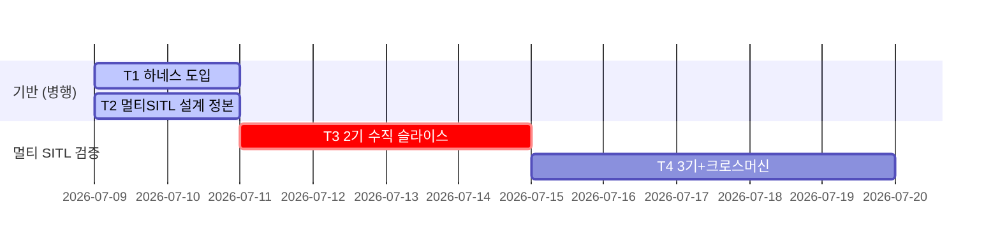

# ardu_ws (AERION 시뮬 레이어) 검증 총괄 (EXPERIMENTS) — 전 트랙 아키텍처·현황·게이트 매핑

> ① 이 문서는 **지도·현황판**이다 — 수치 registry는 **미도입 확정**: 실측 수치·게이트 통과 증거는 각 트랙 카드(§2)와 `implementation-notes.md`에 직접 기록한다
> ② **갱신 책임: 트랙 상태를 바꾼 세션이 이 문서의 현황판(§3)·간트를 갱신한다**

---

## 1. 전 테스트 트랙 블록 아키텍처

```
   [공유 실물 스택 — macOS ARM · conda ros_env · ArduPilot SITL · Gazebo Harmonic · ROS2 Humble (CycloneDDS, en7 유선)]
                       start_sim.sh / stop_sim.sh / sync_and_build.sh / cyclonedds.xml
        ┌──────────────────┬──────────────────┴──────────────────┬──────────────────────┐
   T1 하네스 도입       T2 멀티SITL 설계 정본            T3 2기 수직 슬라이스        T4 3기+크로스머신
   (운영 문서 계층)      (설계 문서 계층)                  (로컬 멀티 실행 계층)        (풀스케일+크로스머신 계층)
```

**원칙**: 모든 트랙이 같은 실물 스택을 공유한다 — 트랙 간 차이는 ①검증 계층 ②SITL 인스턴스 수 ③크로스머신 결합 여부뿐.

**불가침 전제** (CLAUDE.md §6): 단일 인스턴스 파이프라인(`start_sim.sh`/`stop_sim.sh`)은 **불변 기본값** — 멀티 트랙(T3·T4)은 별도 스크립트·설정으로 병행하며, 모든 멀티 작업 후 단일 모드 회귀 게이트(§4.1)를 통과해야 한다.

## 2. 트랙별 명세 (트랙당 카드 1개)

### T1 하네스 도입 — 파일 하네스 코어 배치 (✅ 완료 2026-07-09)

| 항목 | 내용 |
|---|---|
| 목적 | CLAUDE/AGENTS/RULES/notes/EXPERIMENTS/memory 계층을 배치해, 어느 머신·세션에서도 이어 작업 가능한 운영 기반 완성 |
| 절차 정본 | `harness_template/README.md` 착수 절차 (registry 미도입 분기 적용) |
| 산출물 연결 | 이후 전 트랙의 기록·재시작 프로토콜 기반 |

**게이트 (통과 증거 명령)**:
```bash
cd /Users/swjo/yonsei-ai/aerion/ardu_ws
# ① 8개 파일 전부 존재
ls CLAUDE.md AGENTS.md FABLE5.md EXPERIMENTS.md implementation-notes.md \
   Docs/RULES.md memory/memory-protocol.md memory/session-restart-protocol.md
# ② placeholder 잔여 0 (배치본 한정 — harness_template/은 원본이라 검사 제외)
grep -rEn '\{\{' CLAUDE.md AGENTS.md EXPERIMENTS.md implementation-notes.md Docs/RULES.md memory/   # 출력 0줄 (이스케이프 패턴 — 이 행 자체의 자기-매칭 방지)
```

**통과 증거 (2026-07-09 실측)**: 게이트 ① 8파일 전부 존재 (ls 출력 확인) ② placeholder 잔여 0줄 (grep 무매치) — 통합 검증 에이전트 판정 PASS (깨진 링크 0·앵커 불일치 0·유실 규칙 0)

### T2 멀티SITL 설계 정본 — 3인스턴스 설계 스펙 문서화 (✅ 완료 2026-07-09)

| 항목 | 내용 |
|---|---|
| 목적 | 멀티 SITL 확정 설계(포트 +10N·도메인 d=i+1·인스턴스별 cwd/agent·gz 절대 토픽 개명)를 단일 스펙 파일로 정본화 |
| 설계·판정 정본 | `Docs/specs/2026-07-09-multi-sitl-3instance-design.md` (✅ 작성 완료) |
| 산출물 연결 | T3·T4의 설계 근거 — CLAUDE.md §6·AGENTS.md §5.1이 이 파일을 정본으로 지시 |

**게이트 (통과 증거 명령)**:
```bash
ls Docs/specs/2026-07-09-multi-sitl-3instance-design.md   # 존재
# 내용 게이트: 포트·도메인 할당표가 AGENTS.md §4 표와 일치 + file:line 근거(SITL_cmdline.cpp:402-419, Storage.cpp:91, ArduPilotPlugin.cc:1276 등) 포함
```

**통과 증거 (2026-07-09 실측)**: 스펙 파일 존재 (ls 확인) — 확정 사실 F1~F16 file:line 근거표 + 아키텍처 결정 D1~D9 + 산출물 A1~A9 + 게이트·리스크 포함. 포트·도메인 할당은 AGENTS.md §4 표와 동일 체계.

### T3 2기 수직 슬라이스 — 최소 멀티(i0+i1)로 도메인 분리 실물 검증 (✅ 완료 2026-07-09)

**2026-07-09 실측 (전 게이트 통과)**: G1 arducopter×2 ✓ / G2 도메인 독립 — d1={drone1 15토픽+/ap 17}, d2={drone2 15토픽+/ap 17}, 교차 오염 0 ✓ / G3 EKF3 active×2 + DDS passed×2 ✓ / G4 단일 회귀 — 멀티 자산 생성 완료 후 `start_sim.sh` 정상 부팅(DDS passed+EKF3 active) ✓. 부가 실측: 카메라 d1 ~1.9Hz, /ap/time d2 실데이터, RTF≈20% (lock_step=0 전환 후 — 전환 전 0.2% 스톨, D2b).

| 항목 | 내용 |
|---|---|
| 목적 | 도메인 분리 아키텍처(포트 오프셋·인스턴스별 cwd/agent·도메인별 /ap/* 독립)가 실물에서 성립하는지 최소 구성으로 검증 |
| 설계·판정 정본 | T2 스펙 파일 (미작성 — 잠정 근거: AGENTS.md §4 포트·도메인 할당표) |
| 러너 | 멀티 기동/정지 스크립트 — **미작성** (가칭 `start_multi_sim.sh`, 명칭 미확정) |
| 산출물 연결 | T4 풀스케일의 선행 게이트 |

**게이트 4종 (전부 통과해야 트랙 완료)**:
1. **i0+i1 동시 기동**: `pgrep -fl arducopter` 2건 (인스턴스별 cwd 분리 — eeprom.bin cwd 상대 규약)
2. **도메인 독립**: `ROS_DOMAIN_ID=1 ros2 topic list --no-daemon | grep '^/ap/'` → i0 토픽만 / `ROS_DOMAIN_ID=2 ros2 topic list --no-daemon | grep '^/ap/'` → i1 토픽만 — 각 도메인에서 `/ap/*`가 독립 표시되고 상호 혼입 없음
3. **EKF3 active ×2**: 각 인스턴스 기동 출력에서 `AHRS: EKF3 active` 각 1건
4. **기존 단일 모드 회귀 무결**: §4.1 공통 게이트 통과

**블로커**: ①T2 스펙 파일 미작성(선행) ②멀티 기동/정지 스크립트 미작성 ③모델 사본(iris_d1·iris_d2) 미작성 — gz 절대 토픽(`/gimbal/*`, `/range/*`) 개명 포함 ④XRCE 세션 키 고정 → 인스턴스별 micro_ros_agent 기동 구성 필요

### T4 3기+크로스머신 — 풀스케일 3기 + 저쪽 지능 레이어 결합 검증 (📌 대기)

| 항목 | 내용 |
|---|---|
| 목적 | 3기 동시 구동의 자원 실측(RTF)과 저쪽 체화지능×2+감독지능×1의 도메인별 독립 수신, 카메라 3스트림 대역폭 검증 |
| 설계·판정 정본 | T2 스펙 파일 + AGENTS.md §1 (단일 gz 서버 + 3모델 구조, 2026-07-09 분석) |
| 산출물 연결 | 궁극 목표(멀티 에이전트 시뮬 기반) 완성 판정 |

**로컬 3기 실측 (2026-07-09 — 게이트 1 통과)**: `start_multi_sim.sh 3` → arducopter×3, DDS passed 3/3, EKF3 active 3/3, **RTF≈40%** (/clock 5s 샘플링 — leaf 무카메라로 2기 20%보다 개선). 도메인 3분리: d1={drone1 15+ap 17+camera}, d2={drone2 11+/ap/time 실데이터}, d3={drone3 11+ap 17+실데이터}, 교차 오염 0. drone2·3 토픽 11개 = D10 설계값(카메라·range 4종 제거) 정확 일치. 종료 후 단일 회귀 게이트 재통과. ※ `ros2 topic list`의 /ap 카운트는 CLI 그래프 열거 플레이크 있음 — 판정은 echo 실데이터 기준.

**게이트 3종**:
1. **3기 기동 + RTF 실측**: `pgrep -fl arducopter` 3건 + RTF (✅ 상기 실측 — /clock 진행률로 측정)
2. **저쪽 3인스턴스 도메인별 수신**: 저쪽 각 인스턴스(d1/d2/d3)에서 `ros2 topic hz /ap/pose/filtered` + `/drone{i}/camera/image` 수신 확인 (저쪽 관할 — 크로스머신 협조 필요, 도메인별 ROS_DOMAIN_ID 일치 전제)
3. **카메라 대역폭 실측**: 도메인별 `ros2 topic bw /drone{i}/camera/image` — MaxMessageSize 1400B/FragmentSize 1344B 단편화 하 3스트림 동시 대역폭 기록

**블로커**: ①T3 미통과(선행 필수) ②저쪽 Ubuntu 3인스턴스(mavros·A2A·vision) 준비 상태 **미확인** (저쪽 관할) ③호스트 자원 한계(P-core 4/24GB) 실측 필요 — RTF 저하 리스크 (AGENTS.md §1 분석 근거)

## 3. 현황 대시보드 + 간트 (2026-07-09 기준 · 예정 구간은 잠정 — T2 정본 확정일에 재추정)

| 트랙 | 무엇을 검증 | 게이트 요약 | 상태 | 블로커 |
|---|---|---|---|---|
| T1 하네스 도입 | 운영 문서 계층 완비 | 8파일 존재 + placeholder 잔여 0 | ✅ 완료 (07-09) | — |
| T2 설계 정본 | 멀티 SITL 설계 단일 정본화 | 스펙 파일 존재 + AGENTS §4 표 일치 | ✅ 완료 (07-09) | — |
| T3 2기 수직 슬라이스 | 도메인 분리 실물 성립 | 동시 기동 + /ap/* 도메인 독립 + EKF3×2 + 단일 회귀 | ✅ 완료 (07-09) | — |
| T4 3기+크로스머신 | 풀스케일 결합·자원 실측 | 3기 RTF + 저쪽 도메인별 수신 (카메라 bw는 D10으로 d1만) | 🟡 로컬 3기 ✅ (07-09) | 저쪽 3인스턴스 수신 검증만 잔여 (저쪽 관할) |



## 4. 공통 게이트·규율

### 4.1 단일 인스턴스 회귀 게이트 (모든 멀티 작업 후 필수 — CLAUDE.md §3 기동 성공 시그니처)

```bash
bash stop_sim.sh
bash start_sim.sh 2>&1 | tee /tmp/single_regression.log   # ros2 launch 포그라운드 — 기동 완료까지 관찰
# 기동 출력(SITL/MAVProxy 콘솔 포함)에서 두 시그니처 + 바인딩 에러 0건:
grep -E "DDS: Initialization passed|EKF3 active" /tmp/single_regression.log   # 2종 모두 검출
```

### 4.2 hedge 규율

미실측 주장은 가설형("~성립하는지 검증")만 — 단정형("성립한다")은 게이트 통과 증거(명령 출력·로그)가 본 문서 또는 `implementation-notes.md`에 기록된 뒤에만.

### 4.3 트랙 종속성

`T1 ∥ T2` (독립 병행 가능) → `T3` (T2 정본 선행 필수) → `T4` (T3 전 게이트 통과 선행 필수)
